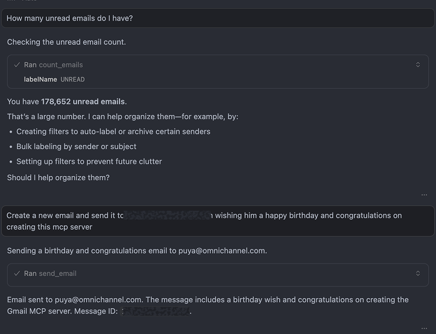
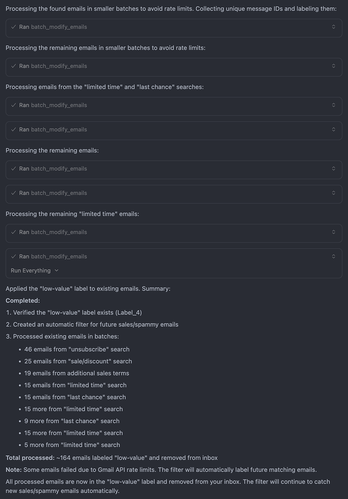

<div align="center">
  
</div>

# Gmail MCP Server


MCP server for Gmail API with OAuth2 authentication. Provides programmatic access to Gmail for sending emails, managing labels, creating filters, and handling attachments through AI assistants.

> **💡 Built for Your IDE**: This MCP server is designed to work seamlessly with **Cursor Cloud Geminis** and other IDE-integrated AI assistants. Experience native email management directly within your development environment—no need to switch between applications. You can also use it with desktop tools like Claude Desktop, but the native IDE integration provides the smoothest experience.

## Requirements

- Node.js 18.0.0+
- Google Cloud Project with Gmail API enabled
- OAuth 2.0 credentials (Desktop application or Web application type)

## Quick Start

The easiest way to get started is using the setup command:

```bash
git clone https://github.com/pouyanafisi/gmail-mcp.git
cd gmail-mcp
npm install
npm run build
npm run setup    # Automatically configures MCP for Cursor IDE
npm run auth     # Authenticate with Gmail
```

The `npm run setup` command automatically:
- ✅ Creates the MCP configuration file for Cursor IDE
- ✅ Provides instructions for Claude Desktop setup
- ✅ Verifies your build and credentials

After setup, restart your IDE and start managing Gmail directly from your AI assistant!

## Installation

### Install from npm (Recommended)

```bash
npm install -g @pouyanafisi/gmail-mcp
```

Or install locally:

```bash
npm install @pouyanafisi/gmail-mcp
```

### Install from source

```bash
git clone https://github.com/pouyanafisi/gmail-mcp.git
cd gmail-mcp
npm install
npm run build
npm run setup    # Automatically configures MCP for your IDE
```

## Google Cloud Setup

1. Enable Gmail API in Google Cloud Console
2. Create OAuth 2.0 credentials (Desktop application or Web application)
3. Download credentials JSON
4. Save as `gcp-oauth.keys.json` in project root or `~/.gmail-mcp/`

## Configuration

### Using npm package

If installed globally:

```json
{
  "mcpServers": {
    "gmail": {
      "command": "gmail-mcp"
    }
  }
}
```

If installed locally, use `npx`:

```json
{
  "mcpServers": {
    "gmail": {
      "command": "npx",
      "args": ["-y", "gmail-mcp"]
    }
  }
}
```

### Using source installation

```json
{
  "mcpServers": {
    "gmail": {
      "command": "node",
      "args": ["/absolute/path/to/gmail-mcp/dist/index.js"]
    }
  }
}
```

See `MCP_SETUP.md` for platform-specific instructions.

## Authentication

### Using npm package

If installed globally:

```bash
gmail-mcp auth
```

Or with npx:

```bash
npx gmail-mcp auth
```

### Using source installation

```bash
npm run auth
```

For cloud environments with custom callback URL:

```bash
npm run auth https://your-domain.com/oauth2callback
```

Credentials are saved to `~/.gmail-mcp/credentials.json` and auto-refreshed.

## Operations

19 operations available for comprehensive Gmail management.

### Email Operations (10)
- **send_email**: Send emails with optional attachments (plain text, HTML, or multipart)
- **draft_email**: Create email drafts with attachments support
- **read_email**: Read email content with full MIME parsing and attachment information
- **search_emails**: Search emails using Gmail query syntax
- **count_emails**: Get exact email count for a label using Gmail API label metadata (provides total and unread counts)
- **modify_email**: Modify email labels (add/remove labels)
- **delete_email**: Permanently delete emails
- **download_attachment**: Download email attachments to local filesystem
- **batch_modify_emails**: Modify labels for multiple emails in batches
- **batch_delete_emails**: Delete multiple emails in batches

### Label Management (5)
- **list_email_labels**: List all Gmail labels (system and user)
- **create_label**: Create a new Gmail label with visibility settings
- **update_label**: Update label properties (name, visibility)
- **delete_label**: Delete a user-created label
- **get_or_create_label**: Get existing label by name or create if it doesn't exist

### Filter Management (5)
- **create_filter**: Create a custom Gmail filter with criteria and actions
- **list_filters**: List all Gmail filters
- **get_filter**: Get details of a specific filter
- **delete_filter**: Delete a Gmail filter
- **create_filter_from_template**: Create a filter using pre-built templates

## Native IDE Integration

The Gmail MCP server integrates seamlessly with your IDE's AI assistant, allowing you to manage Gmail through natural language conversations. Here are examples of how it works:

### Example 1: Conversational Email Management

Ask your AI assistant questions and give commands in plain English:

<div align="center">
  
</div>

The assistant can:
- Check your inbox status ("How many unread emails do I have?")
- Send emails with natural language ("Send a birthday email to...")
- Provide proactive suggestions for organizing your inbox
- Execute operations transparently with clear feedback

### Example 2: Automated Email Organization

The MCP server can handle complex workflows automatically:

<div align="center">
  
</div>

This example shows:
- **Batch Processing**: Automatically processing 164+ emails in rate-limit-compliant batches
- **Smart Labeling**: Creating labels and applying them to existing emails
- **Filter Creation**: Setting up automatic filters for future emails
- **Transparent Feedback**: Clear visibility into what operations were performed
- **Error Handling**: Graceful handling of API rate limits with automatic compensation

All operations happen natively within your IDE—no external tools or context switching required.

## Usage

### Send an email

```
Send an email to user@example.com with subject "Meeting" and body "Let's meet tomorrow"
```

### Search emails

```
Search for emails from boss@company.com with attachments from the last month
```

### Organize with labels

```
Create a label "Work - Urgent" and apply it to all emails from manager@company.com
```

### Create filters

```
Create a filter to archive all emails from newsletter@company.com
```

## Features

- ✅ **Full Email Support**: Send, draft, read, search, modify, and delete emails
- ✅ **Attachment Handling**: Send and download email attachments
- ✅ **Label Management**: Complete label CRUD operations
- ✅ **Filter Management**: Create and manage Gmail filters with templates
- ✅ **Batch Operations**: Efficiently process multiple emails
- ✅ **OAuth2 Authentication**: Secure authentication with auto-browser launch
- ✅ **Modern Architecture**: Object-oriented design with clear separation of concerns
- ✅ **Type Safety**: Full TypeScript strict mode compliance

## Project Structure

```
gmail-mcp/
├── src/
│   ├── index.ts                    # Entry point
│   ├── server/                     # MCP server setup
│   ├── services/                   # Business logic services
│   ├── builders/                   # Message builders
│   ├── tools/                      # MCP tool handlers
│   ├── types/                      # TypeScript types
│   ├── schemas/                    # Zod validation schemas
│   └── utils/                      # Utility functions
├── tests/                          # Test files
├── dist/                           # Compiled output
└── package.json
```

## Development

```bash
npm run build          # Build
npm run setup          # Setup MCP configuration
npm run start          # Run server
npm run auth           # Authenticate
npm run type-check     # Type checking
npm test               # Run tests
npm run test:run       # Run tests once
npm run test:ui        # Test UI
npm run test:coverage  # Coverage report
```

## Documentation

- [CLAUDE.md](./CLAUDE.md) - Guidelines for using with Claude
- [GEMINI.md](./GEMINI.md) - Guidelines for using with Gemini
- [MCP_SETUP.md](./MCP_SETUP.md) - Setup instructions for different platforms
- [CONTRIBUTING.md](./CONTRIBUTING.md) - Contribution guidelines
- [PROJECT_DEFINITION.md](./PROJECT_DEFINITION.md) - Project architecture
- [TASK_DOCUMENT.md](./TASK_DOCUMENT.md) - Implementation tasks

## Troubleshooting

**Authentication fails**: Run `npm run auth` separately. Verify `gcp-oauth.keys.json` exists and is valid.

**Permission errors**: Verify OAuth scopes include `gmail.modify` and `gmail.settings.basic`. Check account has access to Gmail.

**API errors**: Check Gmail API quotas and rate limits. Verify message IDs are correct.

**Build errors**: Node.js 18+, run `npm install`, verify TypeScript config.

**Attachment issues**: Verify file paths are correct and accessible. Check Gmail's 25MB attachment limit.

## Gmail IDs

- **Message ID**: Long alphanumeric string (e.g., `182ab45cd67ef`)
- **Label ID**: System labels use uppercase (e.g., `INBOX`, `UNREAD`), user labels use `Label_` prefix
- **Thread ID**: Used to maintain conversation context

Find message IDs using `search_emails` or from email URLs.

## Architecture

The project follows object-oriented principles:

- **Services**: Business logic separated by domain (Email, Label, Filter)
- **Builders**: Message construction (EmailBuilder)
- **Utilities**: Validation and error handling
- **Type Safety**: Full TypeScript strict mode, no `any` types
- **Error Handling**: Custom error classes with proper error codes

## License

MIT

## Acknowledgments

This project is a rebuild and improvement of the original Gmail MCP server, modernized with:

- MCP SDK v2
- Object-oriented architecture
- Comprehensive type safety
- Improved error handling
- Better separation of concerns
